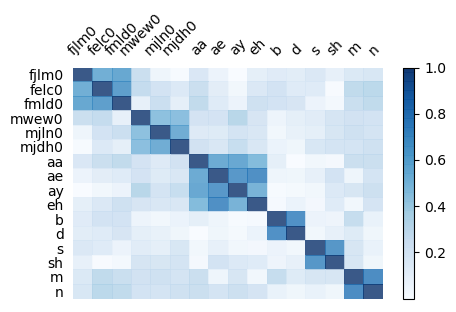
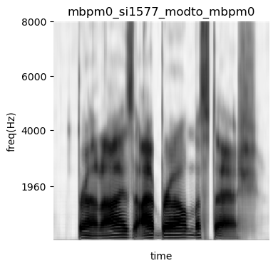
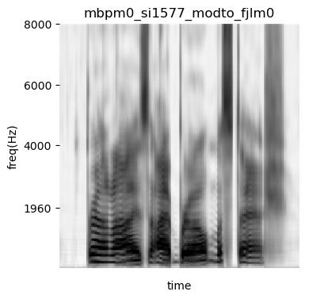
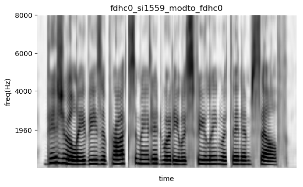
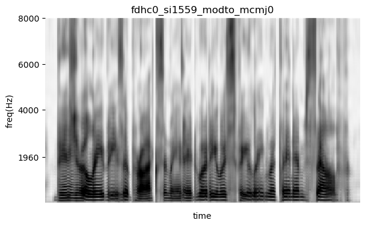

# Learning Latent Representations for Speech Generation and Transformation
This repository contains the code to reproduce the core results from the paper 
[Learning Latent Representations for Speech Generation and Transformation](https://arxiv.org/abs/1704.04222).

To cite this work, please use
```
@inproceedings{hsu2017learning,
  title={Learning Latent Representations for Speech Generation and Transformation},
  author={Hsu, Wei-Ning and Zhang, Yu and Glass, James},
  booktitle={Interspeech},
  pages={1273--1277},
  year={2017},
}
```

# Dependencies
This project uses Python 2.7.6. Before running the code, you have to install
* [Tensorflow 1.0](https://www.tensorflow.org/)
* [Scipy](https://www.scipy.org/)
* [Numpy](http://www.numpy.org/)
* [CFFI](http://cffi.readthedocs.io/en/latest/)
* [Soundfile](https://pysoundfile.readthedocs.io/en/0.9.0/)
* [Matplotlib](http://matplotlib.org/)
* [Kaldi](https://github.com/kaldi-asr/kaldi)
* [Kaldi-Python](https://github.com/janchorowski/kaldi-python/)

The former 6 dependencies can be installed using pip by running
```
pip install -r requirements.txt
```

The last one requires Kaldi before a specific commit (`d1e1e3b`). If you don't have 
Kaldi before that version, you can install both Kaldi and Kaldi-Python by running
```
make all
```

# Usage
The code structure follows Kaldi's convention. Scripts for each dataset can be found in
`egs/<dataset>` folder. If you have questions, please write an email to wnhsu@csail.mit.edu

## TIMIT
To reproduce the experiments for TIMIT, run:
```
cd egs/timit
./run_spec.sh --TIMIT_RAW_DATA <timit_raw_data_dir>
```

### Orthogonality between latent attribute representations


### Transforming a male speaker to a female speaker 

#### Before



#### After



### Transforming a female speaker to a male speaker 

#### Before


#### After

